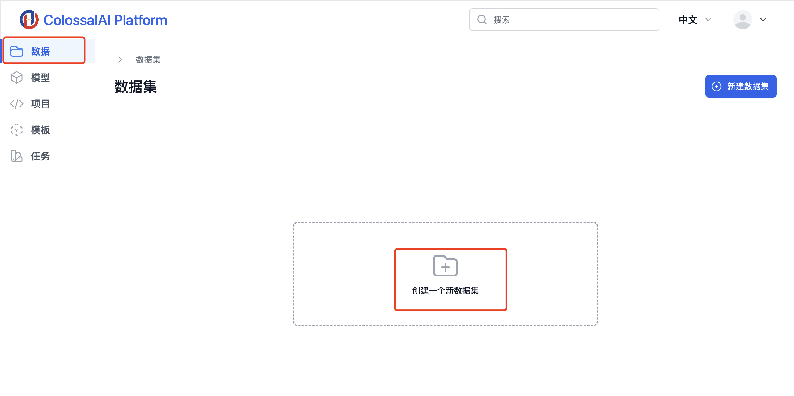
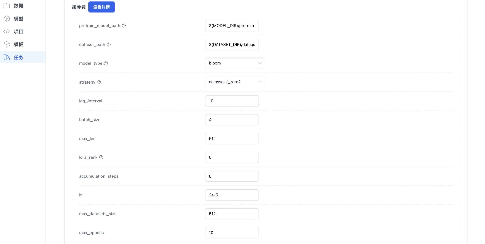

# 微调 llama2 模型

## 介绍

ColossalAI 平台是一个全托管的机器学习平台，它无缝地结合强大的计算能力和最先进的大模型加速和优化框架 ColossalAI。平台提供了多个大模型训练模版，可以让用户以无代码的方式，通过只上传数据集，来完成大模型的微调或预训练。在本文中，我们将讲解如何通过平台提供的 ColossalChat 模版，在用户提供的数据上微调一个 llama2 模型。

## 流程详解

### 1. 准备和创建对话数据集

首先，您需要在本地创建一个文件夹名，打开文件夹之后，在里面创建一个名为`data.json`的文件，其中包含您的对话数据集。

请参照以下 json 格式来构建您的对话数据集。

```json
[
  {
    "instruction": "Give three tips for staying healthy.",
    "input": "",
    "output": "1.Eat a balanced diet and make sure to include plenty of fruits and vegetables. \n2. Exercise regularly to keep your body active and strong. \n3. Get enough sleep and maintain a consistent sleep schedule."
  },
  {
    "instruction": "What are the three primary colors?",
    "input": "",
    "output": "The three primary colors are red, blue, and yellow."
  }
]
```

### 2. 上传数据集

准备好本地的数据集`data.json`之后。点击左边的**数据**栏，选择**创建一个新数据集**。


在**上传数据集**界面，填写数据集名称、数据集描述，在**上传您的数据集**区域，选择上传您本地的包含`data.json`的文件夹，最后点击上传按钮。


上传成功后，您将会在数据集详情界面看到您已经上传完成的数据文件。您可以对这个数据集的文件进行管理，例如添加文件，下载文件，删除文件等等。


### 3. 创建训练任务

点击左边的**任务**边栏，并在右上角点击**新建任务**。

在**任务**界面，选择**通过模版**创建任务的选项。

在**训练设置**界面，填写任务名称、任务描述，在模版选项里选择`colossalai/ColossalChat`。

> 所有前缀为`colossalai/`的模型都是 ColossalAI 官方提供的模型


在**超参数**界面，选择您需要的超参数配置，例如模型类型选择、训练策略选择、epoch 数目等等。如无特殊需求，可以直接使用默认配置。


- pretrain_model_path：（选填）如果您没有在**训练设置**中选择**模型**，便可以忽略这个选项。在本教程中，您可以保持默认设置。
  - 如果您想要从自定义预训练模型开始训练，需要先在**模型**界面上传或者在训练后注册您的预训练模型，并在在这里填写您的预训练模型的路径。路径格式为：`$(MODEL_DIR)/[模型相对路径]`。预训练模型的相对路径为您在**模型**界面上上传的模型的在（`/root/`之后的）相对路径。例如，如果您的模型文件在**模型详情**界面的路径为`root/pretrain/`,这里您需要填写`$(MODEL_DIR)/pretrain`。
  - 我们平台提供的镜像内置了从 HuggingFace 下载的预训练模型，如果您选择用镜像内置的模型，请保持默认配置。
- dataset_path：这里填写您的数据集的路径。路径格式为：`$(DATASET_DIR)/[模型相对路径]`。数据集模型的相对路径为您在**数据集**界面上上传的数据的在（`/root/`之后的）相对路径。例如，如果您的数据集文件在**数据集详情**界面的路径为`root/data.json`,这里您需要填写`$(DATASET_DIR)/data.json`。
- model_type：大语言模型类型，这里我们在提供了 bloom-350m、opt、gpt2 和 llama2 四种模型。在本教程中，请选择 llama。
- strategy：ColossalAI 优化策略
- log_interval：日志打印的频率
- batch_size：批大小
- max_len：最大长度序列
- lora_rank
- accumulation_steps：累计梯度的步数
- lr：学习率
- max_dataset_size：最大数据集大小
- max_epochs：训练轮数

在**数据集**选项，请选择您之前创建好的数据集。
**模型**为可选选项，如果您在平台内已经注册过，或者上传模型，在这里可以的选择您以拥有的模型文件。在本教程中，您可以不选择任何模型。

在**资源设置**，选择您所需要的机器类型，和机器数量。

- 我们的机器的 GPU 卡间会利用 Nvlink 进行加速。
- 如果您选择了多台机器，机器之前将通过 RDMA 进行训练加速。

当您配置完成后，请点击**启动任务**按钮。

### 4. 监控训练任务

在训练过程中，您可以通过点击**日志**的选项，来查看当前的日志进度。


在训练过程中，您可以通过点击**指标**的选项，


### 5. 处理训练输出文件

训练结束后，您可以在**任务详情**界面的**输出文件**选项卡中看到训练的输出文件。您可以选择下载这些文件，或者选择**注册模型**来注册您的`checkpoint/`目录下的文件，注册后的模型，可以在**模型**界面看到注册后的模型文件目录。

输出文件将包括一下几种文件

- `checkpoint/pretrain`：训练后的产生的模型文件
- `checkpoint/optm_ckpt`: 优化器的 checkpoint 文件
- `tensorboard/`：训练产生的 tensoborad 文件
- `master-0.txt`：master 节点产生的日志文件
- `worker-1.txt`：第一个 worker 节点产生的日志文件


模型注册之后，可以在**模型**界面，管理当前模型目录下的文件。

