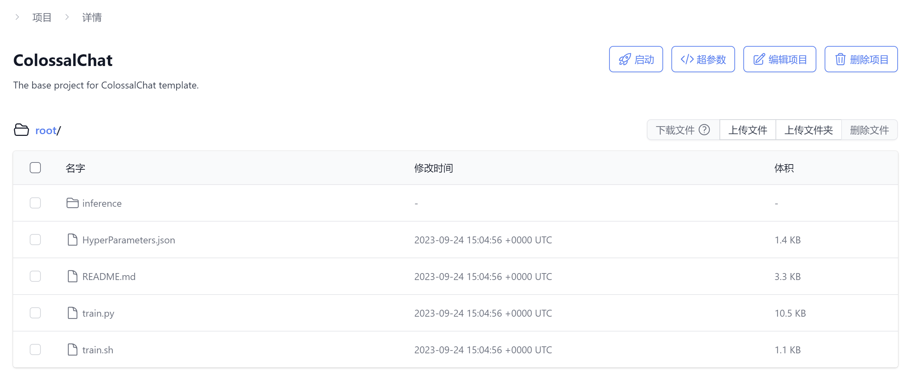

# 从零启动一个训练任务

## 介绍

在本文中，我们将介绍如何从零创建一个可以运行的项目，并在ColossalAI平台上进行模型训练。

## 流程详解

### 1. 创建项目目录

#### 使用命令行工具
我们强烈推荐您使用我们的命令行工具创建项目目录，这会初始化一个文件夹，其中包含了启动训练必要的文件。安装和使用方法请参考：[命令行工具git仓库](https://github.com/hpcaitech/ColossalAI-Platform-CLI)

#### 手动创建
如果需要手动创建项目，您需要在文件夹中创建一些内容，可以参考：[项目规范](https://docs.platform.luchentech.com/docs/basics/projects#%E9%A1%B9%E7%9B%AE%E8%A7%84%E8%8C%83)

### 2. 上传到云平台

[云平台项目页面](https://platform.luchentech.com/console/project)

创建项目后，可以把文件上传到项目内，入口命令路径为`root/train.sh`

### 3. 创建数据集
您可以参考此文档创建数据集：[创建数据集文档](https://docs.platform.luchentech.com/docs/basics/datasets)

#### 使用数据集

数据集路径会以环境变量的形式注入容器，您可以通过`$DATASET_DIR`获取。假设上传的数据路径为`root/data.json`，在训练代码中对应为`$DATASET_DIR/data.json`

### 4. 创建模型
您可以参考此文档创建模型：[创建模型](https://docs.platform.luchentech.com/docs/basics/model)

#### 使用模型

模型路径会以环境变量的形式注入容器，您可以通过`$MODEL_DIR`获取。假设上传的模型文件夹路径为`root/pretrain`，在训练代码中对应为`$MODEL_DIR/pretrain`

### 5. 创建训练任务
您可以参考此文档创建训练任务：[训练任务](https://docs.platform.luchentech.com/docs/training/jobs)

选择从项目启动，填写上述步骤中创建的内容，即可开始训练。