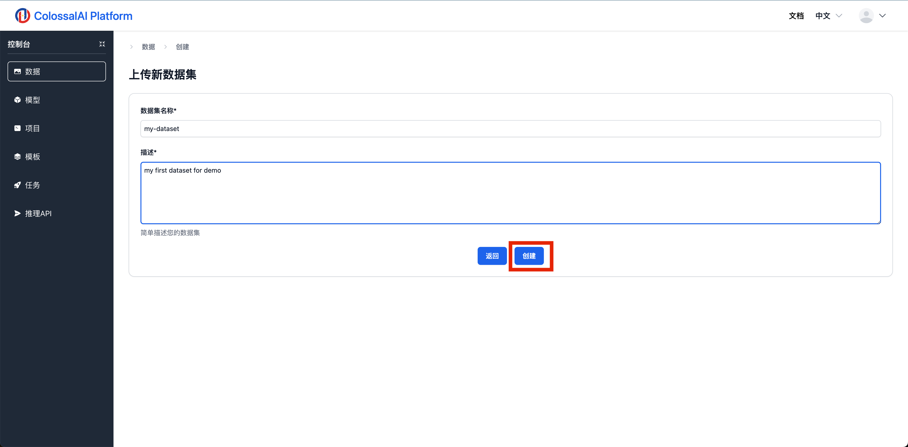
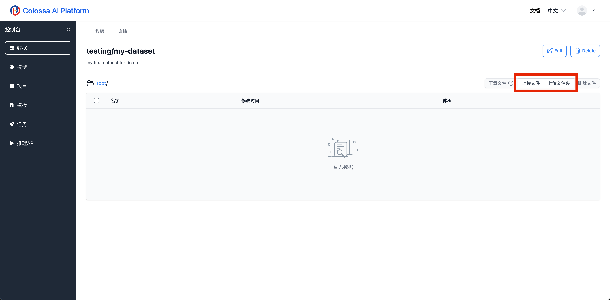

# 数据集管理

## 简介

在 Colossal-AI 云平台，用户可以统一管理他们训练需要用到的各类数据集，并将这些数据集加载到训练任务重用于训练模型。接下来，我们将会引导您创建您的数据集，您可以跳转到[任务管理](../training/jobs.md)文档查看如何将数据集加载到训练任务中。

## 创建数据集

您需要按照以下步骤来创建一个新的数据集。

1. 然后在界面的右侧点击”新建数据集“的按钮

2. 输入数据集的相关信息，点击创建按钮，这样就得到一个空的数据集。

3. 点击红色框内的按钮上传您的数据集文件。

上传数据集时会显示一个进度条来展示上传的进度。上传完之后可以点击文件浏览器查看上传好的文件。

## 管理文件

上传完数据集时候，您可以在文件浏览器上选中一个文件，在右侧的菜单栏中可以删除或者下载该文件。

## 公开数据集

在数据集的展示页面，我们可以看到用户可以访问公共数据集。在这个板块，用户可以看到其他用户分享的数据集，并将这些数据集用在自己的训练任务中。

用户也可以将自己的数据集公开，只需要点击自己的数据集，然后在右上角选择编辑数据集。在编辑页面，用户可以把可见性设置为公开，这样其他用户也可以直接使用数据集进行训练。Colossal-AI平台官方会逐步放置一些常用数据集在平台上供用户使用。

