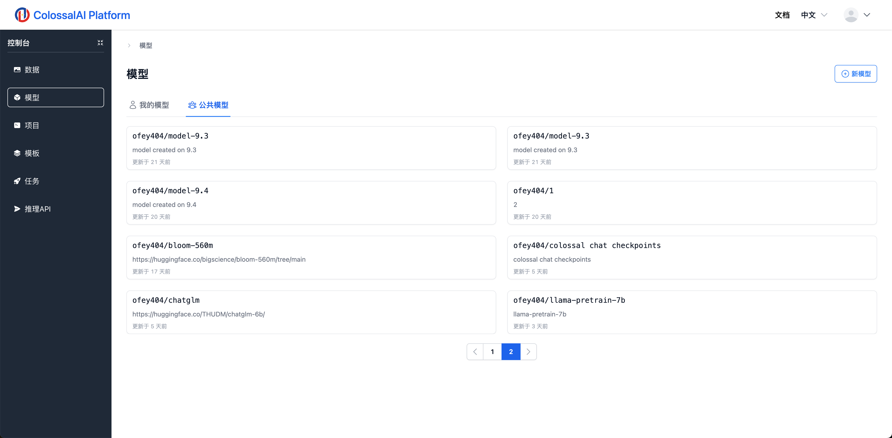

# 模型管理

## 简介

模型界面可以用于管理您的模型。您可以自行上传已经训练好的模型，也可以从训练成功的任务中注册到模型库，以便日后在任务启动页面使用。

## 创建模型

模型的新建、删除、编辑等和数据集相似，可以查看[数据集管理](./datasets.md)文档熟悉流程。需要注意的是，我们支持直接从一个训练完成的任务中保存模型，相关步骤我们会在[训练任务](../training/jobs.md)中介绍。

