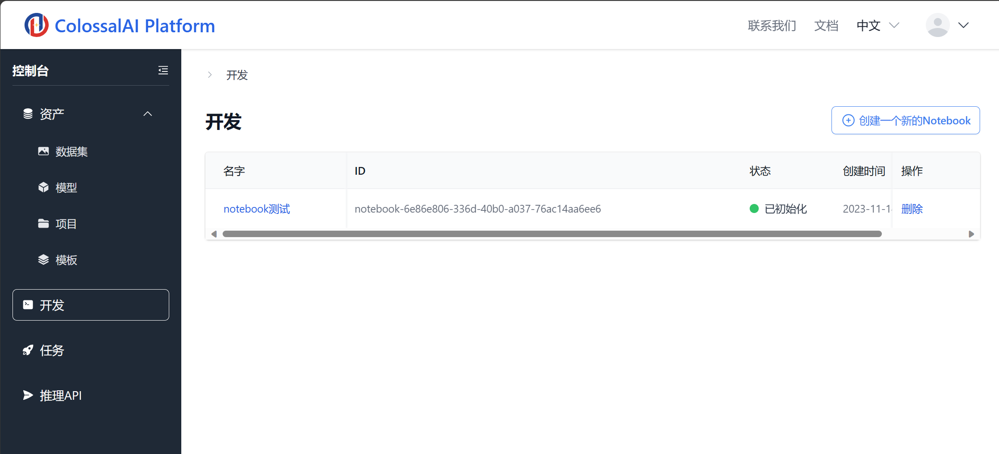
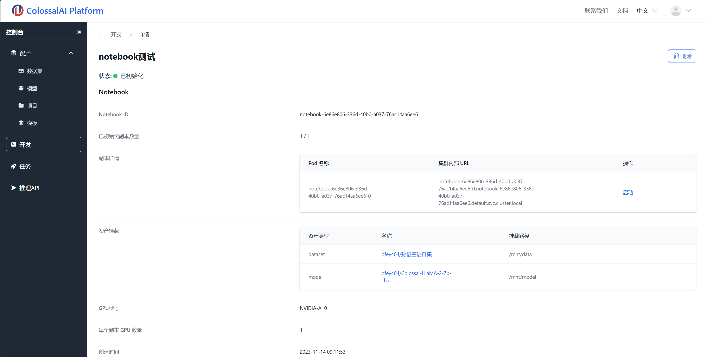

# 交互式开发

## 简介

Colossal-AI 云平台提供了交互式开发功能，用户能够在集群中申请算力，启动 Pod，使用 Jupyter Notebook 进行开发。

主要功能有：

1. 支持基于浏览器的开发环境，目前已经适配 Jupyter Notebook，后续会支持 VSCode、ssh 连接。
2. 提供开箱即用的 Colossal-AI 开发环境，可训练微调 Llama 等流行模型。
3. 支持多机多卡的开发环境，超越单机卡数的限制。

## 界面导览

点击主界面上的**控制台-开发**按钮，进入交互式开发面板。

主界面列出了启动的 Notebook，可以在这里创建、删除、连接交互式开发环境。

进入开发环境详情，可以查看开发环境的详细信息，包括目前状态、连接方式、挂载的代码与数据等。

更详细的操作指南，可以参考[创建交互式开发环境](../notebook/create.md)。
