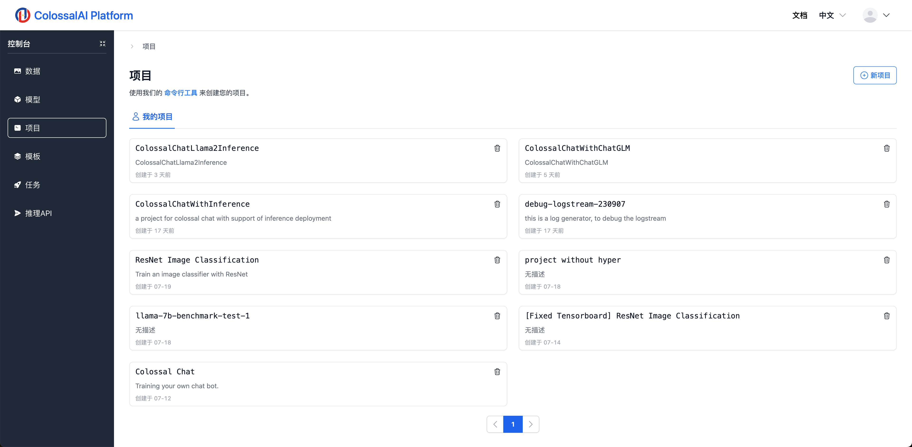

# 项目管理

## 简介

项目(project)包含了我们训练所需要的代码，可以把一个项目理解为一个代码库。在Colossal-AI云平台上，我们将直接加载项目代码用于训练。

## 项目规范

为了对接云平台的训练任务流程，我们要求一个项目必须包含以下为了能够在平台上运行，代码项目必须包含以下文件：

- `HyperParameters.json`: 定义了用户启动训练时需要设置的超参数，在启动任务时将被加载到UI上，用户可以直接在UI上设置超参数来快速启动训练。
- `train.sh`: 任务启动的入口文件，云平台将在K8S上执行这个bash文件来启动训练。
- `train.py`: 项目训练代码的统一入口文件，将在`train.sh`被调用。在`train.py`里，我们需要实现对分布式训练的支持。
- `README.md`: 项目代码的文档，用于指导用户如何准备数据集、模型以及进行训练和推理。

为了帮助用户更方便的创建一个符合以上规范的项目，我们提供了Colossal-AI云平台CLI，来帮助用户一键初始化项目以及必要文件，详情可以查看[CLI使用说明](../cli/cli.md)。

## 创建项目

在本地我们使用CLI初始化项目并添加了相关的逻辑代码之后，我们便可以将项目上传到Colossal-AI云平台了，相关的操作和数据集类似，可以查看[数据集管理](./datasets.md)文档熟悉流程

