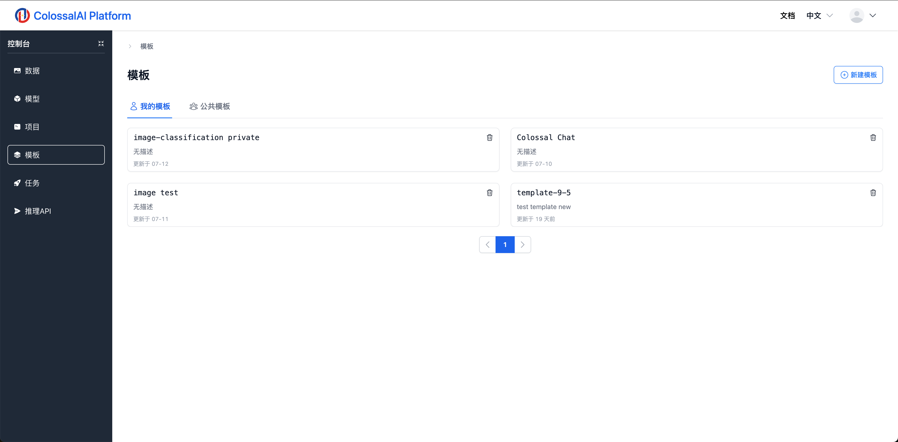

# 模版管理

## 简介

模板是一个不可变的代码项目，一个模板由一个项目转换而来。如果对代码项目的效果满意，用户可以将自己的项目以及镜像打包成一个模板，便于之后反复使用。同时，用户也可以选择将模板发布到公有模板中，便于其他用户使用。

## 创建模版

我们可以在模版列表页面点击右上角的按钮创建新的模板，创建页面如图所示：

我们需要填写相关的描述信息，同时选择是否公开这个模板。在最后两行，我们也需要选择这个模板所使用的项目代码以及运行的镜像，这样一来我们就成功打包了一个可以反复使用的AI模板。

## 官方模版

我们将会在公共模板市场里提供开箱即用的AI应用模板，比如基于Llama, Llama2, ChatGLM等模型的Colossal Chat对话机器人，相关团队会逐步增加更多的AI应用供大家微调以及部署。
