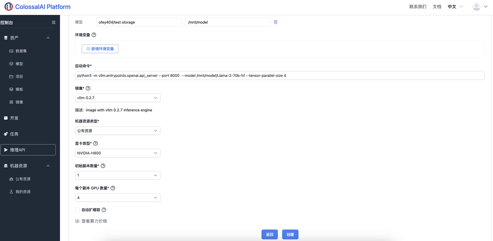

# 推理API 使用: 利用vLLM部署 Llama-2-70b-hf 推理服务

Llama 2 是一系列预训练和微调的生成文本模型，规模从 70 亿到 700 亿参数不等。在这个演示中，我们将展示如何在我们的平台上使用4块 H100GPU 利用 [vLLM](https://github.com/vllm-project/vllm) 为 [Llama-2-70b-hf](https://huggingface.co/meta-llama/Llama-2-70b-hf) 提供 推理API服务。

Tags:  推理API，Llama 2，70B模型，vLLM

## 运行环境要求

镜像：推荐使用官方镜像 vLLM 0.2.7

GPU规格：推荐使用H800 （4块及以上）

## 1. 准备Llama-2-70b-hf模型

可使用云平台内置的Llama-2-70b-hf模型，或从 [Hugging Face](https://huggingface.co/meta-llama/Llama-2-70b-hf) 下载 Llama-2-70b-hf 模型权重，并上传到 Colossal-AI 云平台。其模型权重文件夹应包含如下文件:


```
config.json
generation_config.json
.gitattributes
LICENSE.txt
model-00001-of-00015.safetensors
model-00002-of-00015.safetensors
model-00003-of-00015.safetensors
model-00004-of-00015.safetensors
model-00005-of-00015.safetensors
model-00006-of-00015.safetensors
model-00007-of-00015.safetensors
model-00008-of-00015.safetensors
model-00009-of-00015.safetensors
model-00010-of-00015.safetensors
model-00011-of-00015.safetensors
model-00012-of-00015.safetensors
model-00013-of-00015.safetensors
model-00014-of-00015.safetensors
model-00015-of-00015.safetensors
model.safetensors.index.json
pytorch_model-00001-of-00015.bin
pytorch_model-00002-of-00015.bin
pytorch_model-00003-of-00015.bin
pytorch_model-00004-of-00015.bin
pytorch_model-00005-of-00015.bin
pytorch_model-00006-of-00015.bin
pytorch_model-00007-of-00015.bin
pytorch_model-00008-of-00015.bin
pytorch_model-00009-of-00015.bin
pytorch_model-00010-of-00015.bin
pytorch_model-00011-of-00015.bin
pytorch_model-00012-of-00015.bin
pytorch_model-00013-of-00015.bin
pytorch_model-00014-of-00015.bin
pytorch_model-00015-of-00015.bin
pytorch_model.bin.index.json
README.md
Responsible-Use-Guide.pdf
special_tokens_map.json
tokenizer_config.json
tokenizer.json
tokenizer.model
USE_POLICY.md
version.txt
```


## 2. 启动推理API

1. 在控制台中选择`推理API`选项，点击 `创建新的API`；

2. 填写对应的API名称和描述；

3. 挂载文件：将之前准备好的 Llama-2-70b-hf 模型挂载到 Container 中，在这个例子里，模型被挂载到了 `/mnt/model/Llama-2-70b-hf`；

4. 启动命令：填入 `python3 -m vllm.entrypoints.openai.api_server --port 8000 --model /mnt/model/Llama-2-70b-hf --tensor-parallel-size 4`，在这行命令中，我们使用了4块 GPU 部署了适配 OpenAI API protocol 的推理API服务；
    - 在上述指令中，要运行多GPU并行服务，请在启动服务器时传入 --tensor-parallel-size 参数。例如，要在4个GPU上运行API服务器。

5. 镜像设置：选择官方镜像 `vllm-0.2.7`；

6. 显卡配置：推荐选择 `NVIDIA-H800`，每个副本 GPU 数量设置为大于等于 `4`；

7. 最后点击 `创建`，启动API推理服务，等待2-3分钟api服务完成启动；



## 3. 测试推理API

1. 待API创建完成后，从页面获`API URL`，如 `http://inference-api-77.colossal-ai.platform.luchentech.com`；

2. 向此`API URL`发送如下示例请求，注意URL应放置前一步获取的`API URL`，`model`后应填写之前挂载的文件夹位置，如 `/mnt/model/Llama-2-70b-hf`：
```bash
curl http://inference-api-77.colossal-ai.platform.luchentech.com/v1/completions \
-H "Content-Type: application/json" \
-d '{
"model": "/mnt/model/Llama-2-70b-hf",
"prompt": "San Francisco is a",
"max_tokens": 7,
"temperature": 0
}'
```

3. 或者也可以使用 python client 发送请求：
```python
from openai import OpenAI
# Set OpenAI's API key and API base to use vLLM's API server.
openai_api_key = "EMPTY"
openai_api_base = "http://inference-api-77.colossal-ai.platform.luchentech.com/v1"

client = OpenAI(
    api_key=openai_api_key,
    base_url=openai_api_base,
)

chat_response = client.chat.completions.create(
    model="/mnt/model/Llama-2-70b-hf",
    messages=[
        {"role": "system", "content": "You are a helpful assistant."},
        {"role": "user", "content": "Tell me a joke."},
    ]
)
print("Chat response:", chat_response)
```

3. API 服务器会处理请求， 并返回如下格式的结果：

```
{{"id":"cmpl-65ab9c31268e41fab85afBa0d7371567","object":"text completion","creatd":264386,"model":"/mnt/model/Llama-2-78b-hf","choices":[{"index":8,"text":" ciy of neighborhoods, each with","logprobs":null,"finish reason":"length"}],"usag":f"prompt tokens":5,"total tokens":12,"completion tokens":7}}
```

