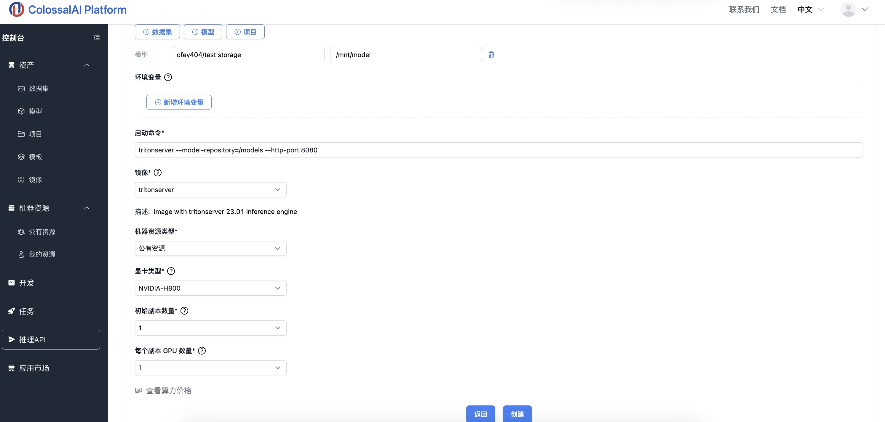

# 推理API使用: 利用 Triton 推理服务器 部署 TensorRT 模型

[TensorRT](https://github.com/NVIDIA/TensorRT)是一个有助于在NVIDIA图形处理单元（GPU）上高性能推理c++库。它旨在与TesnsorFlow、Caffe、Pytorch以及MXNet等训练框架以互补的方式进行工作，专门致力于在GPU上快速有效地进行网络推理。

[Triton推理服务器](https://github.com/triton-inference-server/server)是一种开源推理服务软件，可以简化AI推理。Triton使团队能够从多个深度学习和机器学习框架（包括TensorRT、TensorFlow、PyTorch、ONNX、OpenVINO、Python、RAPIDS FIL等）部署任何AI模型。

这个快速入门指南展示了如何使用 Colossal-AI 云平台在 Triton 推理服务器上使用 TensorRT 加速部署一个简单的 DenseNet 模型。让我们逐步讨论如何在云平台上使用 TensorRT 优化模型、在 Triton 推理服务器上部署它，并构建一个客户端来查询该模型的过程。

Tags:  推理API，TensorRT，Triton Server

## 运行环境要求

镜像：推荐使用官方镜像 triton-server-24.1

GPU规格：推荐使用H800 （1块）

## 1. 准备TensorRT模型

可使用云平台内置的 DenseNet TensorRT 模型，或从 [Triton Server TensorRT Conversion](https://github.com/NVIDIA/TensorRT/tree/main/quickstart/deploy_to_triton#step-1-optimize-your-model-with-tensorrt) 中按步骤转换获得TensorRT 模型，并上传到 Colossal-AI 云平台。


## 2. 启动推理API

1. 在控制台中选择`推理API`选项，点击 `创建新的API`；

2. 填写对应的API名称和描述；

3. 挂载文件：将之前准备好的 DenseNet TensorRT 模型挂载到 Container 中，在这个例子里，模型被挂载到了 `/mnt/model/densenet_tensorrt`；

4. 启动命令：填入 `tritonserver --model-repository=/mnt/model --http-port 8080`，在这行命令中，我们使用了1块 GPU 部署 Triton 的推理API服务；

5. 镜像设置：选择官方镜像 `triton-server`；

6. 显卡配置：推荐选择 `NVIDIA-H800`，每个副本 GPU 数量设置为 `1`；

7. 最后点击 `创建`，启动API推理服务，等待2-3分钟api服务完成启动；



## 3. 测试推理API

1. 待API创建完成后，从页面获`API URL`，如 `http://inference-api-77.colossal-ai.platform.luchentech.com`；

2. 向此`API URL`发送如下示例请求，注意url应放置前一步获取的`API URL`
```bash
docker pull nvcr.io/nvidia/tritonserver:24.01-py3-sdk
docker run -it --rm --net=host nvcr.io/nvidia/tritonserver:24.01-py3-sdk

/workspace/install/bin/image_client -url http://inference-api-77.colossal-ai.platform.luchentech.com -m densenet_tensorrt -c 3 -s INCEPTION /workspace/images/mug.jpg
```

3. 或者也可以使用 python client 发送请求：

安装相关python环境
```bash
wget  -O img1.jpg "https://www.hakaimagazine.com/wp-content/uploads/header-gulf-birds.jpg"
pip install torchvision
pip install attrdict
pip install nvidia-pyindex
pip install tritonclient[all]
```

运行下方python脚本
```python
import numpy as np
from torchvision import transforms
from PIL import Image
import tritonclient.http as httpclient
from tritonclient.utils import triton_to_np_dtype

def dn50_preprocess(img_path="img1.jpg"):
    img = Image.open(img_path)
    preprocess = transforms.Compose([
        transforms.Resize(256),
        transforms.CenterCrop(224),
        transforms.ToTensor(),
        transforms.Normalize(mean=[0.485, 0.456, 0.406], std=[0.229, 0.224, 0.225]),
    ])
    return preprocess(img).numpy()

transformed_img = dn50_preprocess()

# Setup a connection with the Triton Inference Server.
triton_client = httpclient.InferenceServerClient(url="http://inference-api-77.colossal-ai.platform.luchentech.com")

# Specify the names of the input and output layer(s) of our model.
test_input = httpclient.InferInput("input", transformed_img.shape, datatype="FP32")
test_input.set_data_from_numpy(transformed_img, binary_data=True)

test_output = httpclient.InferRequestedOutput("output", binary_data=True, class_count=1000)

# Querying the server
results = triton_client.infer(model_name="densenet_tensorrt", inputs=[test_input], outputs=[test_output])
test_output_fin = results.as_numpy('output')

print(test_output_fin[:5])

```

4. API 服务器会处理请求， 并返回如下格式的结果：
```
Request 0, batch size 1
Image '/workspace/images/mug.jpg':
    15.346230 (504) = COFFEE MUG
    13.224326 (968) = CUP
    10.422965 (505) = COFFEEPOT
```

