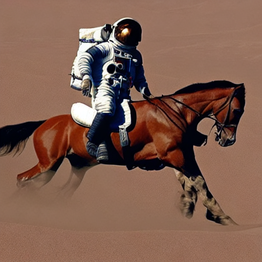

## 基于TensorRT的Stable Diffusion推理

Stable Diffusion 是一种生成模型，可以根据文本和图像提示生成独特的逼真图像。 它最初于2022年推出。我们将介绍如何利用Colossal-AI faster-diffusers从Huggingface的仓库里将模型直接转换为TensorRT Engine并用于推理加速。

Tags: 加速，推理，Diffusers，Stable Diffusion，TensorRT

### 运行环境要求

镜像：推荐使用官方镜像 colossalai 0.3.4

GPU规格：推荐使用H800 （1块及以上）

### 1. 准备项目文件

在此样例中，我们使用预置好的`Stable Diffusion Inference`项目文件，稍后我们会将此项目挂载在我们的任务上。

### 3. 启动开发环境

1. 在控制台中选择`开发`选项，点击 `创建一个新的Notebook`；

2. 填写对应的开发环境名称和描述；

3. 挂载项目：将之前准备好的 `Stable Diffusion Inference` 文件挂载到 Container 中，在这个例子里，项目被挂载到了 `/mnt/project`;

7. 镜像设置：选择官方镜像 `colossalai 0.3.4`；

8. 显卡配置：推荐选择 `NVIDA-H800`，GPU 数量设置为 `1`；

9. 最后点击 `创建`，启动开发环境；

10. 连接开发环境，浏览器将会跳转到对应的 Jupyter notebook。

### 4. Notebook使用

在本例中，我们准备了`./README.ipynb`来提供stable diffusion推理的教程。 其中包含了如下几步：

1. 安装相关依赖；
2. [可选]下载Hugging Face模型，本例中我们已经预置好 sd-v1.5 Hugging Face模型；
3. [可选] 构建TRT引擎，本例中我们已经预置好 sd-v1.5 Hugging Face模型 （构建TensorRT Engine的时间比较久，可能会构建20分钟以上）；
4. 测试txt2img；
5. 测试img2img；

一个示例的text2img结果如下, 其prompt为 "a photo of an astronaut riding a horse on mars":

开始使用此notebook体验您的stable diffsuion推理吧！