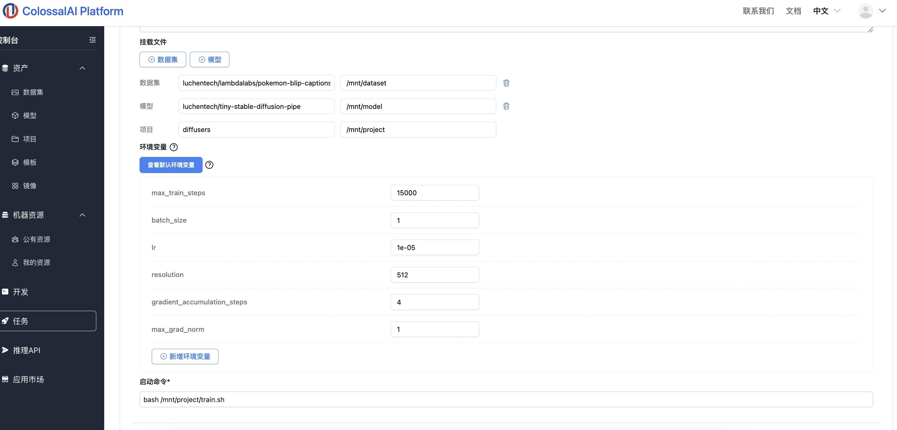

## Stable Diffusion 训练

Stable Diffusion 是一种生成模型，可以根据文本和图像提示生成独特的逼真图像。 它最初于2022年推出。我们将介绍如何使用开源框架 [diffusers](https://github.com/huggingface/diffusers) 实现在云平台上 Stable Diffusion 的训练过程。

Tags:  加速，训练，Diffusers，Stable Diffusion

### 运行环境要求

镜像：推荐使用官方镜像 notebook-colossalai-torch210-cu118

GPU规格：推荐使用H800 （1块及以上）


### 1. 准备数据集与模型

在本例中，我们选择了数据集[lambdalabs/pokemon-blip-captions](https://huggingface.co/datasets/lambdalabs/pokemon-blip-captions), 和测试Stable Diffusion训练流程的tiny模型 [hf-internal-testing/tiny-stable-diffusion-pipe](https://huggingface.co/hf-internal-testing/tiny-stable-diffusion-pipe)。 我们均已预置这些资源在云平台上，稍后我们将挂载此数据集和模型到任务当中。

### 2. 准备项目文件

我们需要克隆[diffusers](https://github.com/huggingface/diffusers)代码仓库。在此样例中，我们使用预置好的`diffusers`项目文件，稍后我们会将此项目挂载在我们的任务上。

### 3. 启动任务

1. 在控制台中选择`任务`选项，点击 `新任务`；

2. 填写对应的任务名称和描述；

3. 挂载数据集：将之前准备好的 `lambdalabs/pokemon-blip-captions` 数据集挂载到 Container 中，在这个例子里，模型被挂载到了 `/mnt/dataset`；

4. 挂载模型：将之前准备好的 `tiny-stable-diffusion-pipe` 文件挂载到 Container 中，在这个例子里，项目被挂载到了 `/mnt/model`;

5. 挂载项目：将之前准备好的 `diffusers` 文件挂载到 Container 中，在这个例子里，项目被挂载到了 `/mnt/project`;

6. 启动命令：填入我们项目中默认的启动命令 `bash /mnt/project/train.sh`。同时您可以在云平台页面通过设置环境变量选择此次训练配置，如图像resolution，epoch大小等。如果您想了解启动命令是如何启动服务的，或者想自定义启动命令，请参考 `3.启动命令`;

    在本例中，我们进行zero2的优化策略，利用8卡进行 max_length为2k，batch_size为1的 LLaMA2 7b模型训练

7. 镜像设置：选择官方镜像 `colossalai 0.3.4`；

8. 显卡配置：推荐选择 `NVIDIA-H800`，GPU 数量设置为大于等于 `1`；

9. 最后点击 `创建`，启动任务；




### 4. 启动命令

在本例中，我们的启动命令如下，它主要做了如下几步：
1. 安装diffusers；
2. 安装其他相关依赖；
3. 启动训练脚本，
    - 这意味着您可以更改训练的base模型，如[stable-diffusion-v1-4](https://huggingface.co/CompVis/stable-diffusion-v1-4)
    - 您也可以更改数据集，但请注意，要在您自己的训练文件上运行，请根据datasets所需的格式准备数据集，您可以在[此处](https://huggingface.co/docs/datasets/v2.4.0/en/image_load#imagefolder-with-metadata)找到如何执行此操作的说明


``` bash
#!/usr/bin/env bash
SCRIPT_DIR="$( cd -- "$( dirname -- "${BASH_SOURCE[0]}" )" &> /dev/null && pwd )"
DATASET_DIR="/mnt/dataset"
MODEL_DIR="/mnt/model"
OUTPUT_DIR="/output"

TRAINING_DATASET_DIR=${DATASET_DIR}/pokemon-blip-captions
TRAINING_MODEL_DIR=${MODEL_DIR}/tiny-stable-diffusion-pipe
CHECKPOINT_SAVE_DIR=${OUTPUT_DIR}/checkpoint

mkdir -p ${SAVE_MODEL_PATH}

cd ${SCRIPT_DIR}
cd diffusers
pip install .

cd examples/text_to_image
pip install -r requirements.txt

accelerate launch --mixed_precision="fp16"  train_text_to_image.py \
  --pretrained_model_name_or_path=$TRAINING_MODEL_DIR \
  --dataset_name=$TRAINING_DATASET_DIR \
  --use_ema \
  --resolution=${resolution} --center_crop --random_flip \
  --train_batch_size=${batch_size} \
  --gradient_accumulation_steps=${gradient_accumulation_steps} \
  --gradient_checkpointing \
  --max_train_steps=${max_train_steps} \
  --learning_rate=${lr} \
  --max_grad_norm=${max_grad_norm} \
  --lr_scheduler="constant" --lr_warmup_steps=0 \
  --output_dir=${CHECKPOINT_SAVE_DIR}
```

开始在云平台上进行定制的Stable Diffusion训练吧！更多信息，请参阅 [diffusers 训练 text to image](https://github.com/huggingface/diffusers/tree/main/examples/text_to_image)。