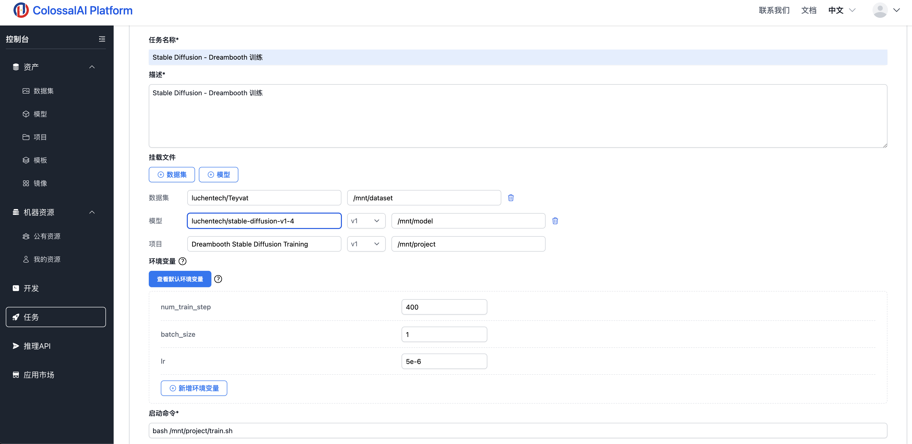

# 并行优化策略: 利用Colossal-AI Dreambooth进行Stable-Diffuison训练

[Colossal-AI Dreambooth](https://github.com/hpcaitech/ColossalAI/tree/main/examples/images/dreambooth) 。在本个实例中，我们将演示如何便捷地使用我们Colossal-AI云平台框架使用这些并行策略训练Stable Diffusion v1.4 模型。

Tags:  Colossal-AI， Dreambooth，训练， Stable Diffsuon

## 运行环境要求

镜像：推荐使用官方镜像 colossalai 0.3.4

GPU规格：推荐使用H800 （2块及以上）

## 1. 准备项目文件

我们需要克隆[Colossal-AI](https://github.com/hpcaitech/ColossalAI)代码仓库。在此样例中，我们使用预置好的项目文件，稍后我们会将此项目挂载在我们的任务上。

## 2. 准备数据库

我们使用[Teyvat](https://huggingface.co/datasets/Fazzie/Teyvat)数据集，此数据集已经预置于我们云平台，稍后我们会将此数据集挂载在我们的任务上。

这个数据集是什么？

> BLIP 从 [genshin-impact fandom wiki](https://genshin-impact.fandom.com/wiki/Character#Playable_Characters) 和 [biligame wiki for genshin impact](https://wiki.biligame.com/ys/%E8%A7%92%E8%89%B2) 生成了角色图像的标题。
> 对于每一行，数据集包含 `image` 和 `text` 键。`image` 是一个大小不等的 PIL png 图像，而 `text` 是相应的文本标题。只提供了一个训练集。
> `text` 包括标签 `Teyvat`、`Name`、`Element`、`Weapon`、`Region`、`Model type` 和 `Description`，`Description` 使用 [预训练的 BLIP 模型](https://github.com/salesforce/BLIP) 进行标题标注。

## 3. 准备模型

我们需要准备预训练好的[CompVis/stable-diffusion-v1-4](https://huggingface.co/CompVis/stable-diffusion-v1-4)模型。在此样例中，此模型已经预置于我们云平台，稍后我们会将此模型挂载在我们的任务上。


## 3. 启动任务

1. 在控制台中选择`任务`选项，点击 `新任务`；

2. 填写对应的任务名称和描述；

3. 挂载预训练模型：将之前准备好预训练模型的 `stable-diffusion-v1-4` 数据集挂载到 Container 中，在这个例子里，模型被挂载到了 `/mnt/model`；

4. 挂载数据集：将之前准备好的 `Teyvat` 数据集挂载到 Container 中，在这个例子里，模型被挂载到了 `/mnt/dataset`；

5. 挂载项目：将之前准备好的 Colossal AI 项目 `Dreambooth Stable Diffusion Training` 文件挂载到 Container 中，在这个例子里，项目被挂载到了 `/mnt/project`;

6. 启动命令：填入我们项目中默认的启动命令 `bash /mnt/project/train.sh`。同时您可以在云平台页面通过设置环境变量选择此次训练配置，如并行策略，Flash Attention加速，epoch大小等。如果您想了解启动命令是如何启动服务的，或者想自定义启动命令，请参考 `3.启动命令`;

7. 镜像设置：选择官方镜像 `colossalai 0.3.4`；

8. 显卡配置：推荐选择 `NVIDA-H800`，GPU 数量设置为大于等于 `2`；

9. 最后点击 `创建`，启动任务；




## 3. 启动命令

1. 在本例中，我们用如下启动命令运行python训练脚本，其位于`./train.sh`。如您想进行更改相关配置，可更改此文件。
```
#!/usr/bin/env bash
SCRIPT_DIR="$( cd -- "$( dirname -- "${BASH_SOURCE[0]}" )" &> /dev/null && pwd )"
MODEL_DIR="/mnt/model"
DATASET_DIR="/mnt/dataset"
OUTPUT_DIR="/output"

COLOSSALAI_PROJECT_DIR=${SCRIPT_DIR}/ColossalAI
TENSORBOARD_OUTPUT_DIR=${OUTPUT_DIR}/tensorboard
CHECKPOINT_SAVE_DIR=${OUTPUT_DIR}/checkpoint
SAVE_MODEL_PATH=${CHECKPOINT_SAVE_DIR}

mkdir -p ${TENSORBOARD_OUTPUT_DIR}
mkdir -p ${SAVE_MODEL_PATH}

cd ${COLOSSALAI_PROJECT_DIR}
pip install ./
cd examples/images/dreambooth/
pip install -r requirements.txt

export MODEL_NAME=$MODEL_DIR/stable-diffusion-v1-4
export INSTANCE_DIR=$DATASET_DIR/Teyvat/data

torchrun --nproc_per_node ${NPROC_PER_NODE}  train_dreambooth_colossalai.py \
  --pretrained_model_name_or_path=$MODEL_NAME  \
  --instance_data_dir=$INSTANCE_DIR \
  --output_dir=$CHECKPOINT_SAVE_DIR \
  --logging_dir=$TENSORBOARD_OUTPUT_DIR
  --instance_prompt="a photo of sks dog" \
  --resolution=512 \
  --train_batch_size=${batch_size} \
  --learning_rate=${lr} \
  --lr_scheduler="constant" \
  --lr_warmup_steps=0 \
  --max_train_steps=${num_train_step}
```

Stable Diffusion 将会就此开始训练，你同时也可以在项目页面查看输出和结果。
