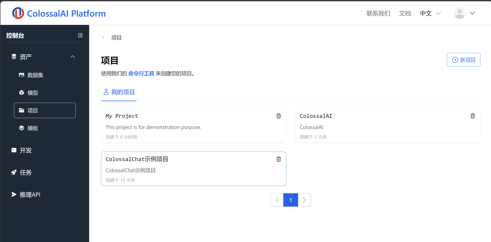
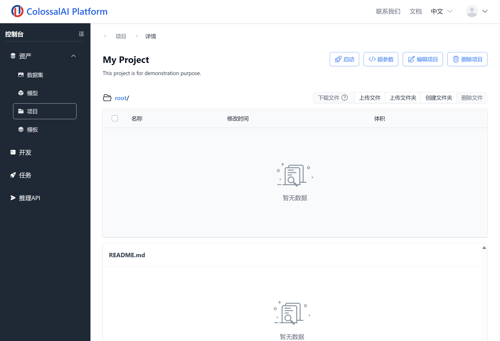
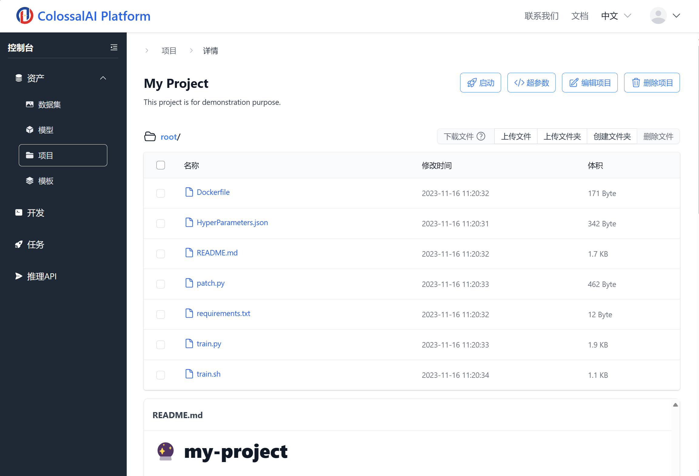

# 创建项目并上传到平台

通过 `cap project init`，用户可以创建一个标准的项目框架。在下面的命令中，替换 `my-project` 为你自己的项目名称。

```bash
cap project init my-project
# Project skeleton `my-project` has been initialized in `/tmp/cap-demonstration/my-project`
# 
# - Edit `train.sh`, `train.py` and `HyperParameters.json` to create your own training project.
# - To upload it to the platform, run `cap project create` and `cap project upload-dir`.
```

这个命令将会在当前目录下，创建如下的项目框架：

```
- my-project
    - Dockerfile
    - train.sh
    - train.py
    - HyperParameters.json
    - README.md
    - requirements.txt
```

## 配置项目框架

`train.sh`,`train.py`,`HyperParameters.json` 为平台启动任务所必需的文件，下面依次介绍它们的功能。

### HyperParameters.json

这个文件定义了用户启动训练任务时，可以从界面输入的超参数。最终的超参数将会作为环境变量传递。

例如，添加超参数定义 `max_epoch` 如下：

```json
// HyperParameters.json
{
  "HyperParameters": [
    {
      "name": "max_epoch",
      "types": "int",
      "defaultValue": "10",
      "description" : "the max epoch of training"
    }
  ]
}
```

启动任务时就会有选框，可以配置 `max_epoch` 的值。


最终对应的环境变量是 `MAX_EPOCH`。

### train.sh

启动训练任务时，平台将会在每个训练容器内运行 `train.sh` 脚本。

训练任务使用 torchrun，挂载的数据、超参数和 RANK 等信息会通过环境变量传入。

项目框架中的 `train.sh` 如下：

```bash
#!/usr/bin/env bash
SCRIPT_DIR="$( cd -- "$( dirname -- "${BASH_SOURCE[0]}" )" &> /dev/null && pwd )"

# ===================================================================
#                Welcome to ColossalAI Platform!
# ===================================================================
# Those environment variables would be injected by the runner:
#
# 1. ColossalAI Platform defined ones:
#    PROJECT_DIR, DATASET_DIR, MODEL_DIR, OUTPUT_DIR, SCRIPT_DIR
#
# 2. Required by torchrun:
#    NNODES, NPROC_PER_NODE, NODE_RANK, MASTER_ADDR, MASTER_PORT
#
# 3. Hyperparameters from configuration UI:
#    (check HyperParameters.json for more details)
#
# After that, the runner would execute `train.sh`, this script.
# ===================================================================

torchrun --nnodes ${NNODES} \
    --nproc_per_node ${NPROC_PER_NODE} \
    --node_rank ${NODE_RANK} \
    --master_addr ${MASTER_ADDR} \
    --master_port ${MASTER_PORT} \
    ${SCRIPT_DIR}/train.py \
    --project_dir ${PROJECT_DIR} \
    --dataset_dir ${DATASET_DIR} \
    --model_dir ${MODEL_DIR} \
    --output_dir ${OUTPUT_DIR}

# TODO: add more argument passing here
```

### train.py

`train.py` 是主要的训练代码。在训练任务中它会被 `train.sh` 调用，在本地测试时，可以另外传入参数来测试。

## 上传项目到平台

### 创建空项目

首先在平台上创建一个空项目。可以使用浏览器界面或者命令行工具。示例命令如下：

```bash
cap project create
# Create an empty project, user: myusername
#   Project name: My Project
#   Project description: This project is for demonstration purpose.
# Do you want to continue [y/N]: y
# Project created successfully, id: 65558667d419d3db7d3ddbb6

cap project list
#   Name: My Project
#   ID: 65558667d419d3db7d3ddbb6
#   Description: This project is for demonstration purpose.
#   Created At: 2023-11-16 03:03:03
# 
#   ...
```

登录平台的浏览器界面，可以在**控制台-资产-项目**下看到创建的项目。



点击进入**详情**，可以看到项目为空。



上传项目代码可以通过浏览器界面中的**上传文件夹**按钮，也可以使用命令行工具 `cap`。接下来演示如何使用命令行工具上传代码。

### 把本地的项目代码上传到平台

首先需要拿到项目的 ID，可以通过 `cap project list` 查看，也可以在浏览器界面上查看 URL 中的 ID。

在上面的示例中，项目 ID 为 `65558667d419d3db7d3ddbb6`。

接下来使用 `cap project upload-dir` 命令上传项目代码。示例输出如下：

```bash
cd my-project/

cap project upload-dir 65558667d419d3db7d3ddbb6 .
# Upload overview:
#     Local directory: /tmp/cap-demonstration/my-project
#     Dataset:
#         ID: 65558667d419d3db7d3ddbb6
#         Name: My Project
#         Description: This project is for demonstration purpose.
#         CreatedAt: 2023-11-16 03:03:03
# 
# The project content would be overwritten.
# 
# Do you want to continue [y/N]: y
# Clearing project 65558667d419d3db7d3ddbb6...
# Uploading directory . as project 65558667d419d3db7d3ddbb6...
# HyperParameters.json => HyperParameters.json
# README.md => README.md
# requirements.txt => requirements.txt
# Dockerfile => Dockerfile
# patch.py => patch.py
# train.py => train.py
# train.sh => train.sh
# Done.
# Directory . uploaded as project 65558667d419d3db7d3ddbb6.
```

上传完成后，可以在浏览器界面上看到项目代码的内容。


