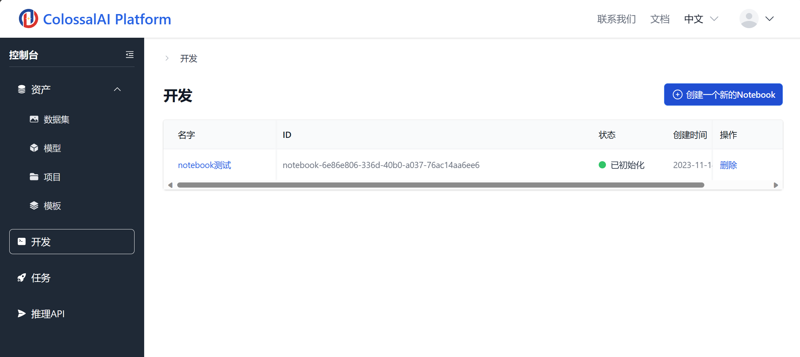
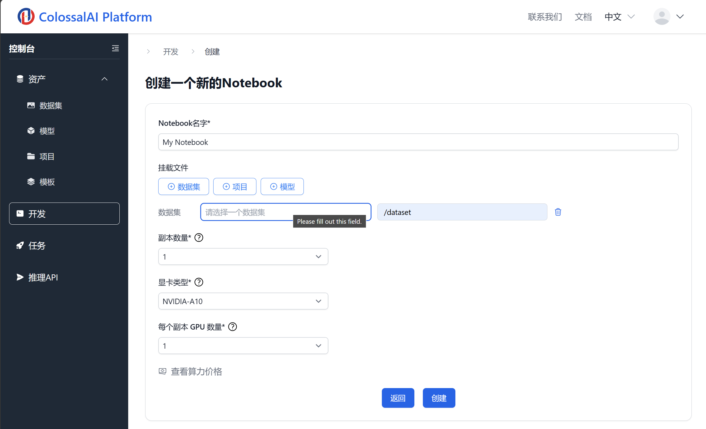
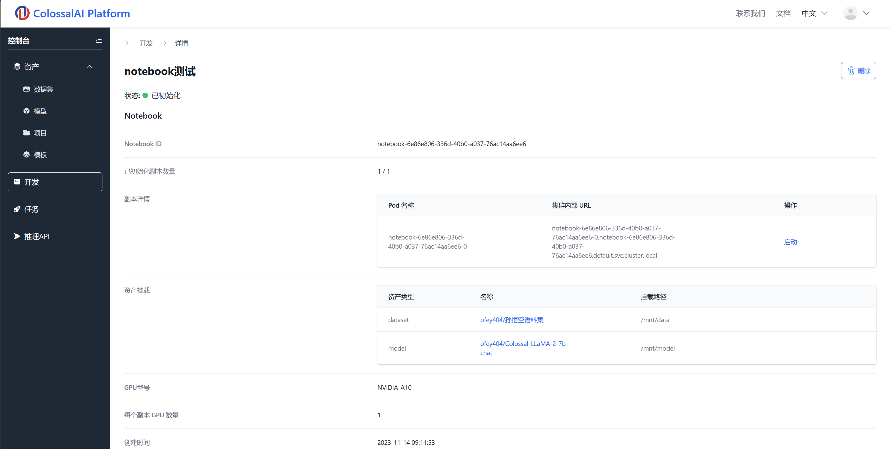
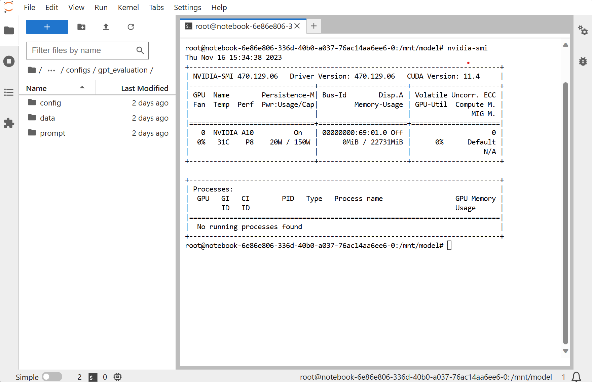

# 创建开发环境

点击主界面上的**控制台-开发**按钮，进入交互式开发面板。

如下图，点击右上角**创建新的Notebook**按钮，进入创建开发环境面板。

## 填写环境信息

在创建面板，我们需要填写相关的信息，包括：

1. 挂载的数据集、项目和模型，挂载的数据可以在开发环境中作为文件使用。
2. 副本数，设置为 1 即为单机开发环境，大于 1 则是多机开发环境，多机之间通过内网域名可以互联。
3. 显卡类型和每个副本的 GPU 数量。
4. 后续会开放镜像选择和镜像仓库功能。

## 连接开发环境

填写完成后，开发环境将会自动创建。如下图，在详情页面，点击**副本详情-启动**，连接开发环境。

浏览器将会跳转到对应的 Jupyter notebook。

## 释放开发环境

使用完毕之后，可以回到主界面，点击**删除**，释放开发环境。

