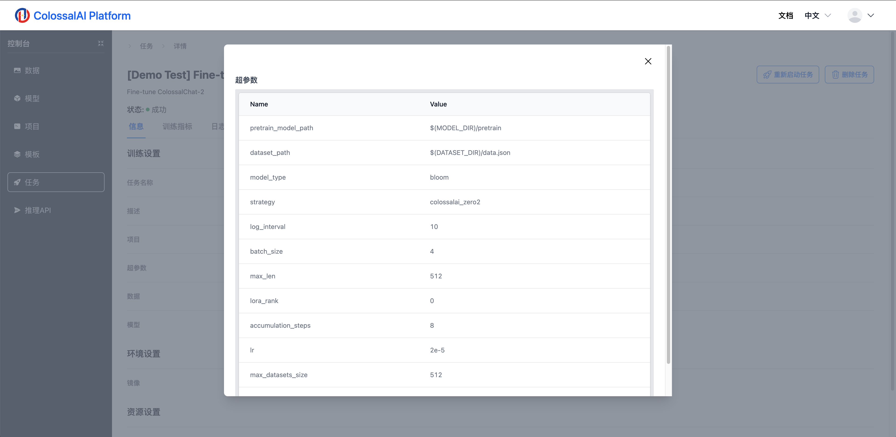
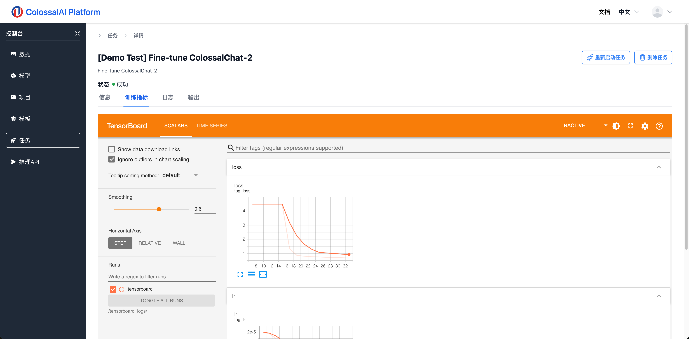
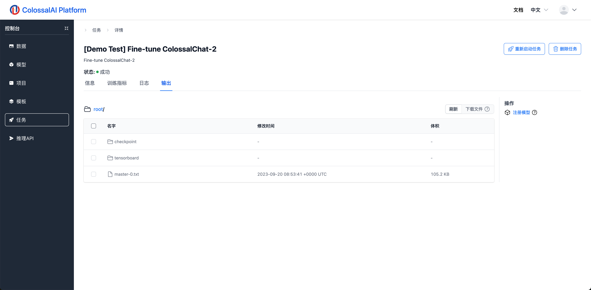

# 查看训练任务详情

## 简介

在训练任务启动之后，页面将会跳转到任务详情页面，在这里，用户可以查看当前任务的各种信息。

## 任务详情

在任务详情界面，共有私有子面板，他们分别是

**任务信息**

这个面板展示了训练任务的基本信息。

用户可以点击“超参数”中的详情查看当前任务的超参数。

**Tensorboard训练指标**

如果训练代码中有使用tensorboard输出log，那么可在此页面查看训练中的指标，比如loss，accuracy等。如果第一次连接，嵌入式页面无响应，可以等待几秒钟并刷新。在任务训练中，我们可以点击Tensorboard右上角的刷新按钮，获取最新的指标数据来监控训练过程。

**日志**

在这个面板，我们可以查看到当前任务的输出日志，这些日志信息有助于我们更好地了解训练情况。点击右上角的按钮可以下载日志到本地。

**任务输出**

这个面板展示了当前训练任务的各类输出文件，其中包含了模型checkpoint，tensorboard日志文件以及节点的标准输出日志。

对于已经完成训练的任务，我们也可以点击右侧的“注册模型”按钮，将训练好的模型文件保存到我们的模型管理数据库中，便于之后使用。

