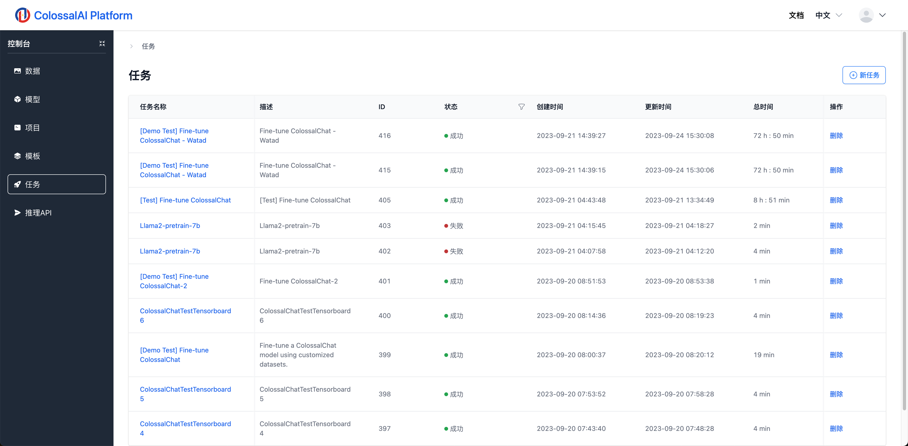
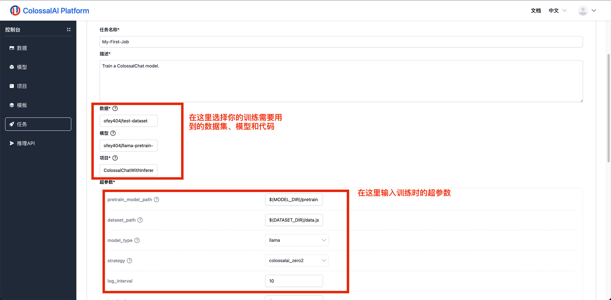
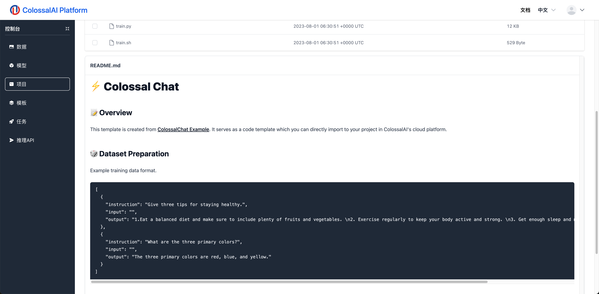
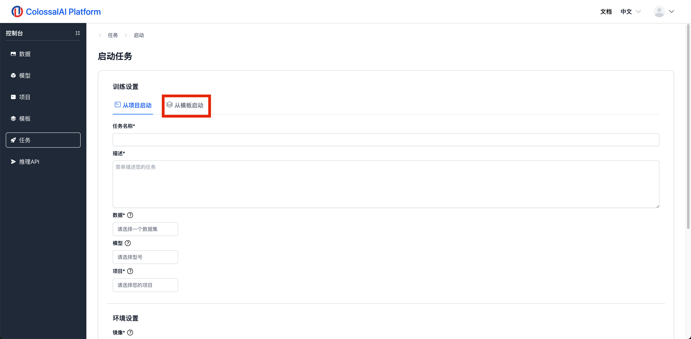

# 训练任务

## 简介

在Colossal-AI云平台上，我们可以使用云平台提供的算力进行模型训练。我们目前提供两种启动训练的方式

1. 加载自己的项目代码开始训练
2. 加载自己或者公有的模板代码开始训练

下面我们会介绍如何实际创建一个训练任务

## 从项目创建训练任务

我们可以在任务列表页面的右上角点击按钮，跳转到创建训练任务的页面。

我们可以看到默认选项为“从项目启动”。首先，我们需要选择我们训练任务中要使用到的数据集、模型以及代码。在选择了项目之后，项目的超参数会弹出，用户可以在此填写本次训练所需要的超参数。

需要注意的是，在选择项目/模板时，用户应该查看他们的`README`，这些`README`提供的详细的数据集/模型格式要求以及使用说明，来减少项目运行报错的可能。

在任务表单的最下面，我们需要选择训练任务的运行环境

选择好镜像以及GPU之后，点击确认，训练任务就开始了。

## 从模版创建训练任务

从模板创建训练任务和上面所展示的流程类似，由于我们已经将镜像打包进了模板里，所以我们无需再设置模板。

